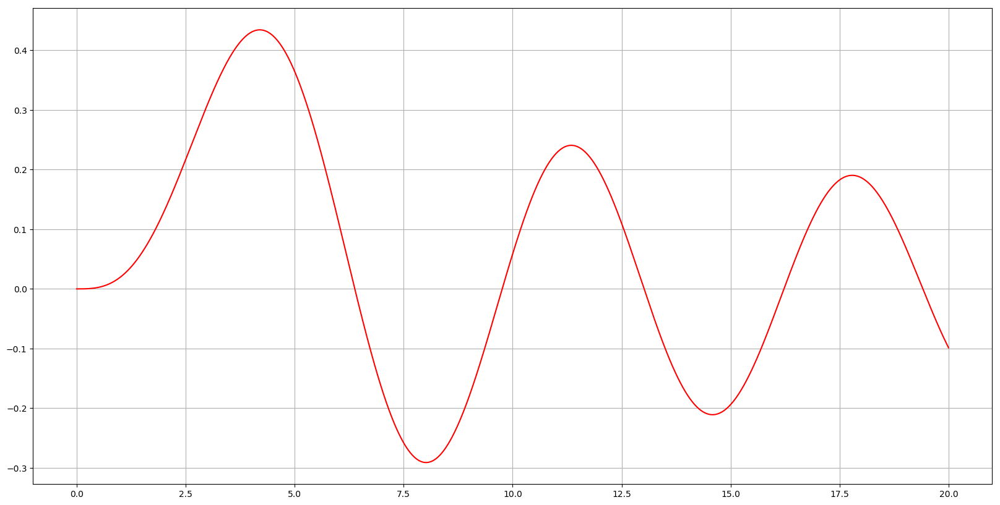
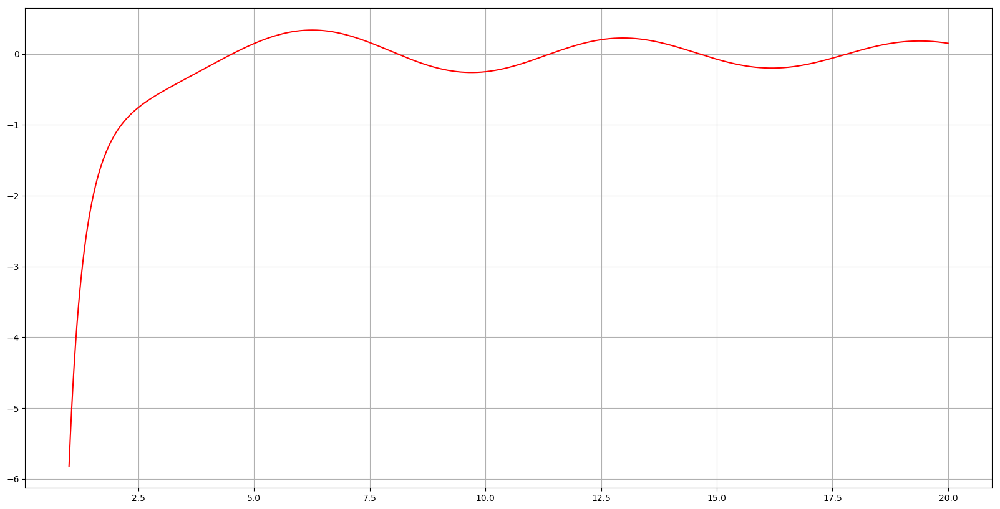

<!--DEBUG-->



## Контрольні запитання до леції №23

### 26. Рівняння для функцій Бесселя дійсного аргументу, функції Бесселя першого та другого роду дійсного аргументу.

При знаходженні розв'язків рівняння Пуассона та Гельмгольца в областях циліндричної форми, рівняння теплопровідності та хвильового рівняння в кругових та циліндричних областях з'являється необхідність записати розв'язки наступних звичайних диференціальних рівняння другого порядку з степеневими коефіцієнтами:

\begin{align}
	x^2 \cdot y'' + x \cdot y' + (x^2 - \nu^2) \cdot y &= 0, \newline
	x^2 \cdot y'' + x \cdot y' - (x^2 + \nu^2) \cdot y &= 0.
\end{align}

У цих рівняннях $$\nu$$ &mdash; числовий параметр.

**Визначення:** Перше рівняння називають _рівнянням Бесселя порядку $$\nu$$_, а друге рівняння називають _рівнянням Бесселя уявного аргументу порядку $$\nu$$_.

<!-- Легко показати, що рівняння друге рівняння можна отримати з першого рівняння якщо ввести заміну незалежної змінної $$\xi = i x$$, цей факт і пояснює назву другого рівняння. -->

#### Функція Бесселя першого роду

Знайти розв'язок цих рівнянь у вигляді елементарних функцій не вдається, тому враховуючи поліноміальний вигляд коефіцієнтів рівняння, можна побудувати розв'язок рівнянь у вигляді узагальненого степеневого ряду:

\begin{equation}
	y(x) = x^\rho \cdot (a_0 + a_1 x + a_2 x^2 + \ldots),
\end{equation}

де $$\rho, a_0, a_1, \ldots$$ &mdash; невідомі коефіцієнти.

<!-- Підставимо цей вигляд у перше рівняння Бесселя і зберемо коефіцієнти при однакових степенях змінної $$x$$:

\begin{equation}
	(\rho^2 - \nu^2)  a_0  x^\rho + ((\rho + 1)^2 - \nu^2)  a_1  x^{\rho + 1} + \Sum_{k = 2}^\infty \left( ((\rho + k)^2 - \nu^2)  a_k + a_{k - 2} \right) x^{\rho + k} = 0.
\end{equation}

З (6.4) отримаємо рівності для визначення коефіцієнтів:

\begin{equation}
	\rho^2 - \nu^2 = 0, \quad a_1 = 0, \quad ((\rho + k)^2 - \nu^2) a_k + a_{k - 2} = 0.
\end{equation}

З першого рівняння маємо: $$\rho = \pm \nu$$.

Оберемо перше значення, а саме $$\rho = \nu$$, тоді отримаємо

\begin{equation}
	\label{eq:7.2}
	a_k = - \frac{a_{k - 2}}{k (2 \nu + k)}, \quad k = 2, 3, \ldots
\end{equation}

Звідси і з другого співвідношення маємо

\begin{equation}
	a_1 = a_3 = \ldots = a_{2 k + 1} = \ldots = 0.
\end{equation}

Для коефіцієнтів з парними індексами з формули \eqref{eq:7.2} легко отримати 

\begin{equation}
	a_{2 k} = (-1)^k \cdot \frac{a_0}{2^{2 k} (\nu + 1) (\nu + 2) \ldots (\nu + k) k!}.
\end{equation}

Обираючи

\begin{equation}
	a_0 = \frac{1}{2^\nu \Gamma(\nu + 1)},
\end{equation}

і підставляючи значення коефіцієнтів в степеневий ряд отримаємо  -->

\begin{equation}
	\label{eq:7.10}
	J_\nu (x) = \Sum_{k = 0}^\infty \frac{(-1)^k}{\Gamma(k + \nu + 1) k!} \left( \frac{x}{2} \right)^{2 k + \nu}.
\end{equation}

<!-- Обираючи друге значення параметру $$\rho = - \nu$$, отримаємо -->

\begin{equation}
	J_{-\nu}(x) = \Sum_{k = 0}^\infty \frac{(-1)^k}{\Gamma(k - \nu + 1) k!} \left( \frac{x}{2} \right)^{2 k - \nu}.
\end{equation}

Відмітимо, що визначення функції $$J_{-\nu}$$ є коректною лише для не цілих значень параметру $$\nu$$, оскільки визначення $$a_0$$ при $$\nu = - n$$ не має змісту, оскільки $$\Gamma(0) = \Gamma(-1) = \ldots = \Gamma(-n) = \infty$$.

Змінюючи в останній формулі індекс сумування $$k = k' + n$$, отримаємо

$$
\begin{equation}
	J_{-n}(x) = (-1)^n \Sum_{k'} \frac{(-1)^{k'}}{\Gamma(k' + n + 1) \Gamma(k' + 1)} \left( \frac{x}{2} \right)^{2 k' + n} = (-1)^n J_n(x).
\end{equation}
$$

<!-- Остання рівність свідчить про лінійну залежність функцій $$J_n(x)$$ та $$J_{-n}(x)$$ і таким чином лінійна комбінація цих функцій не може складати загальний розв'язок рівняння Бесселя. -->

#### Функція Бесселя другого роду

Другий лінійно незалежний розв'язок рівняння Бесселя для довільного значення параметру $$\nu$$, взагалі кажучи не представляється у вигляді узагальненого степеневого ряду. Утворимо спеціальну лінійну комбінацію для нецілих значень параметру $$\nu$$:

\begin{equation}
	N_\nu(x) = \frac{\cos (\nu \pi) \cdot J_\nu(x) - J_{-\nu}(x)}{\sin (\nu \pi)},
\end{equation}

де $$\nu \ne n$$.

<!-- Для $$\nu = n$$, враховуючи попередні викладки, маємо що чисельник і знаменник тотожно перетворюються в нуль, тобто маємо невизначеність типу $$0 / 0$$. Розкриємо невизначеність за допомогою правила Лопіталя:

\begin{equation}
	N_n(x) = \frac{1}{\pi} \left( \left( \frac{\partial J_\nu(x)}{\partial \nu} \right)_{\nu = n} - (-1)^n \left( \frac{\partial J_{-\nu}(x)}{\partial \nu} \right)_{\nu = n} \right).
\end{equation}

Покажемо, що функція $$N_n(x)$$ задовольняє перше рівняння Бесселя. Дійсно, позначимо диференціальний оператор 

\begin{align}
	L(J_\nu) &= J_\nu'' + \frac{J_\nu'}{x} + \left( 1 - \frac{\nu^2}{x^2} \right) J_\nu = 0, \newline
	L(J_{-\nu}) &= J_{-\nu}'' + \frac{J_{-\nu}'}{x} + \left( 1 - \frac{\nu^2}{x^2} \right) J_{-\nu} = 0.
\end{align}

Продиференціюємо останні рівності по $$\nu$$, та отримаємо: 

\begin{align}
	L \left( \frac{\parital J_\nu}{\partial \nu} \right) - \frac{2 \nu}{x^2} \cdot J_\nu &= 0, \newline
	L \left( \frac{\parital J_{-\nu}}{\partial \nu} \right) - \frac{2 \nu}{x^2} \cdot J_{-\nu} &= 0.
\end{align}

Помножимо перше рівняння на $$1$$, друге рівняння на $$(-1)^n$$, віднімемо від першого рівняння друге, отримаємо:

\begin{equation}
	L \left( \frac{\parital J_\nu}{\partial \nu} \right) - (-1)^n L \left( \frac{\parital J_{-\nu}}{\partial \nu} \right)  - \frac{2 \nu}{x^2} (J_\nu - (-1)^n J_{-\nu}) = 0.
\end{equation} -->

Остаточний вигляд функції Бесселя другого роду

$$
\begin{equation}
	\label{eq:7.14}
	\begin{aligned}
		N_n(x) &= - \frac{1}{\pi} \Sum_{k = 0}^{n - 1} \frac{(n - k - 1)!}{k!} \left( \frac{x}{2} \right)^{2 k - n} + \frac{2}{\pi} J_n(x) \ln \frac{x}{2} - \newline
		& \quad - \frac{1}{\pi} \Sum_{k = 0}^\infty \frac{(-1)^k}{k! (k + n)!} \left( \frac{x}{2} \right)^{2k + n} (\Psi(k + n + 1) + \Psi(k + 1)).
	\end{aligned}
\end{equation}
$$

Дуже часто функцію Бесселя другого роду $$N_\nu(x)$$ називають _функцією Вебера_.

### 27. Властивості функцій Бесселя першого та другого роду дійсного аргументу.

### 28. Рівняння для функцій Бесселя уявного аргументу, функції Бесселя першого та другого роду уявного аргументу.

Важливою властивістю функцій Бесселя є асимптотичний характер поведінки цих функцій на нескінченості. <!-- Вводячи функцію $$y(x) = V(x) / \sqrt{x}$$, підставляючи її в рівняння Бесселя отримаємо рівняння

\begin{equation}
	V'' + \left( 1 - \frac{\nu^2 - 1/4}{x^2} \right) V = 0.
\end{equation}

Розв'язки останнього рівняння можна представити для $$x \to \infty$$ у вигляді

\begin{equation}
	V(x) = \gamma \cdot \sin(x + \delta) + O(1 / x),
\end{equation}

а відповідно

\begin{equation}
	y(x) = \gamma \cdot \frac{\sin(x + \delta)}{\sqrt{x}} + O \left( \frac{1}{x^{3/2}} \right).
\end{equation} -->

Додаткові дослідження дозволяють отримати, наступні асимптотичні формули:

\begin{align}
	J_\nu(x) &= \sqrt{\frac{2}{\pi x}} \cdot \cos \left( x - \frac{\nu \pi}{2} - \frac{\pi}{4} \right) + O \left( \frac{1}{x^{3/2}} \right), \quad x \to \infty, \newline
	N_{\nu}(x) &= \sqrt{\frac{2}{\pi x}} \cdot \sin \left( x - \frac{\nu \pi}{2} - \frac{\pi}{4} \right) + O \left( \frac{1}{x^{3/2}} \right), \quad x \to \infty.
\end{align}

Останні формули свідчать про те, що функції Бесселя як першого так і другого роду мають злічену кількість нулів, тобто рівняння $$J_\nu(x) = 0$$, $$N_\nu(x) = 0$$ мають злічену кількість коренів, які для великих значень аргументу $$x$$ асимптотично прямують до нулів  тригонометричних функцій $$\cos \left( x - \frac{\nu \pi}{2} - \frac{\pi}{4} \right)$$, $$\sin \left( x - \frac{\nu \pi}{2} - \frac{\pi}{4} \right)$$. А самі функції Бесселя ведуть себе як $$O(1 / \sqrt{x})$$, $$x \to \infty$$.

Аналіз формул \eqref{eq:7.10} та \eqref{eq:7.14} показує, що при $$x \to 0$$: $$J_n(x) \approx \frac{1}{n!} \left( \frac{x}{2} \right)^n$$, $$n = 0, 1, 2, \ldots$$, $$N_n(x) \approx - \frac{(n - 1)!}{\pi} \left( \frac{x}{2} \right)^{-n} \to \infty$$, $$N_0(x) = \frac{2}{\pi} \ln \frac{x}{2} \to \infty$$, $$x \to 0$$.

Важливою властивістю функцій Бесселя першого та другого роду є рекурентні формули, яким задовольняють функції Бесселя 

\begin{align}
	\frac{\diff}{\diff x} J_\nu(x) + frac{\nu}{x} \cdot J_\nu(x) &= J_{\nu - 1}(x), \newline
	\frac{\diff}{\diff x} J_\nu(x) - frac{\nu}{x} \cdot J_\nu(x) &= - J_{\nu + 1}(x), \newline
	\frac{\diff}{\diff x} N_\nu(x) + frac{\nu}{x} \cdot N_\nu(x) &= N_{\nu - 1}(x), \newline
	\frac{\diff}{\diff x} N_\nu(x) - frac{\nu}{x} \cdot N_\nu(x) &= - N_{\nu + 1}(x).
\end{align}

Виключаючи з двох співвідношень похідну, можна зв'язати між собою функції Бесселя трьох сусідніх порядків.

Для прикладу наведемо графіки функцій Бесселя $$J_3(x)$$ та $$N_3(x)$$:

### 29. Властивості функцій Бесселя першого та другого роду уявного аргументу.

---

[Назад на головну](../README.md)
