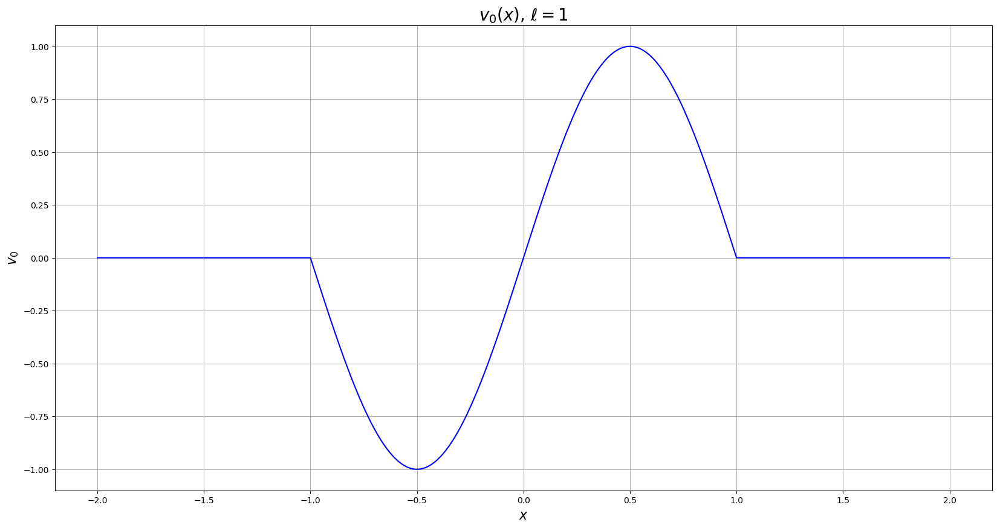
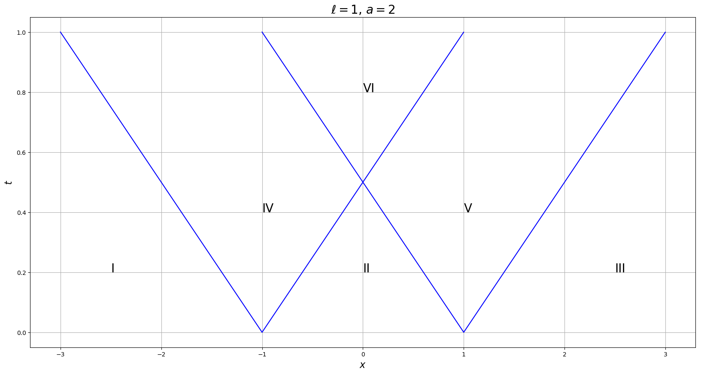
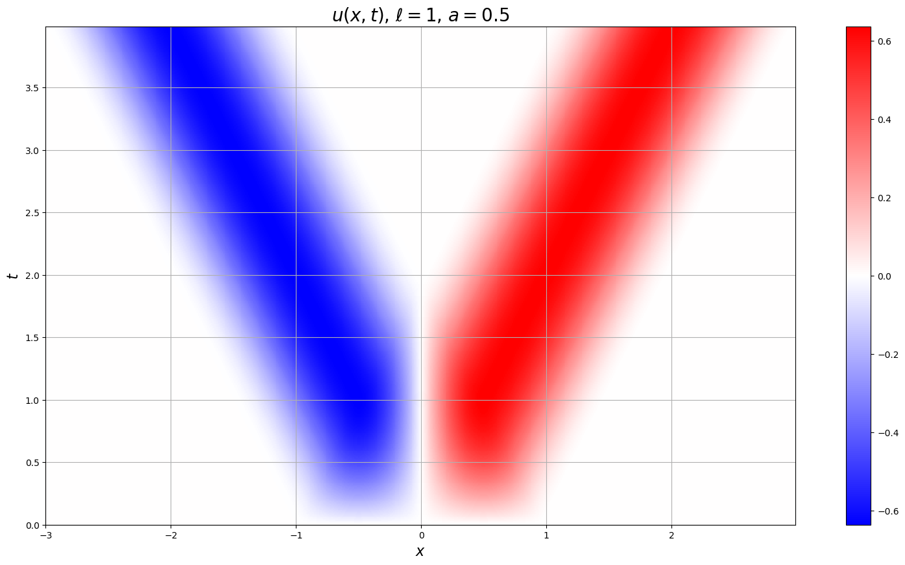
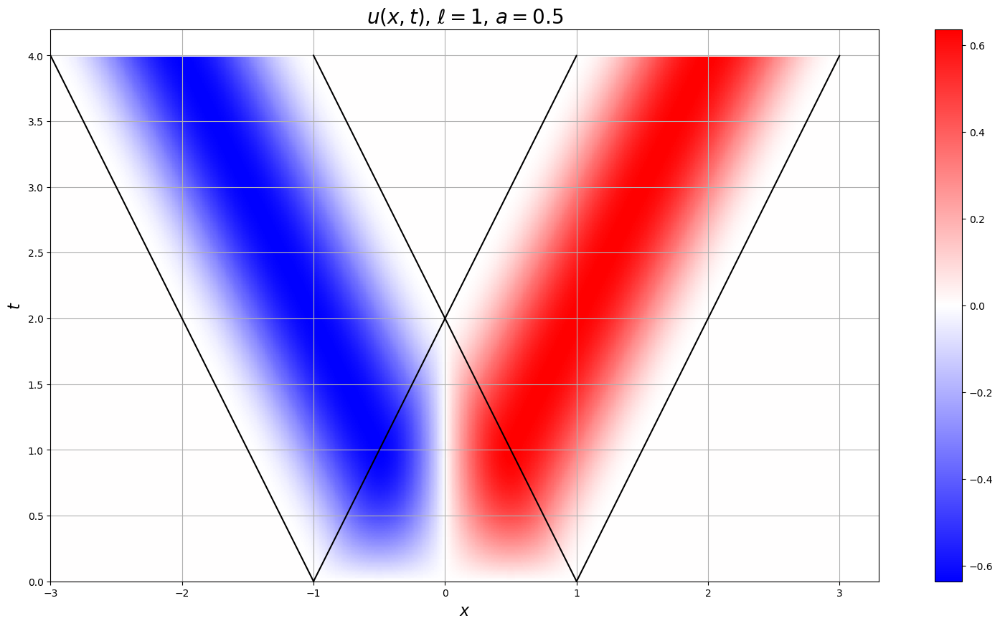



## Третя практична контрольна робота другого семестру

### Варіант 1

#### Задача 1

> Знайти розв'язок задачі про коливання кільцевої мембрани $$r_1 \le r \le r_2$$, $$0 \le \varphi \le 2 \pi$$ із закріпленим внутрішнім краєм та вільним зовнішнім краєм під дією стаціонарної радіально-симетричної зовнішньої сили, якщо початкова швидкість дорівнює нулю, а початкові зміщення задані у вигляді функції, що залежить лише від радіусу.

#### Розв'язок:

#### Задача 2

> Побудувати функцію Гріна оператора Лапласа для області, яка представляє четверту частину кулі $$x^2 + y^2 + z^2 \le R^2$$, $$z > 0$$, $$x > 0$$, якщо на частині сфери задана умова першого роду, на поверхні $$z = 0$$ задана умова другого роду, а на поверхні $$x = 0$$ задана умова першого роду. Записати функцію Гріна у сферичних координатах.

#### Розв'язок:

<!-- _Нагадаємо собі, що оператор Лапласа у $$\RR^3$$ має вигляд:_ 

\begin{equation}
	\Delta u(x, y, z, t) = \frac{\partial^2 u}{\partial x^2} + \frac{\partial^2 u}{\partial y^2} + \frac{\partial^2 u}{\partial z^2}.
\end{equation}

_Також нагадаємо собі, що загальна умова першого роду має вигляд:_

\begin{equation}
	\ell_1 u(x, y, z, t) = u(x, y, z, t) = 0.
\end{equation}

_Також нагадаємо собі, що загальна умова другого роду має вигляд:_

\begin{equation}
	\ell_2 u(x, y, z, t) = \frac{\partial u(x, y, z, t)}{\partial t} = 0.
\end{equation} -->

Нехай у точці $$P_0 = (x_0, y_0, z_0)$$ розташований позитивний одиничний заряд.

Для виконання умови першого роду на поверхні $$x = 0$$ достатньо розташувати від'ємний одиничний заряд у точці $$P_x = (-x_0, y_0, z_0)$$.

Для виконання умови другого роду на поверхні $$z = 0$$ достатньо розташувати позитивний одиничний зарад у точці $$P_z = (x_0, y_0, -z_0)$$. А точніше було б достатньо, якби заряд був лише у точці $$P_0$$, але ми вже розташували один &laquo;уявний&raquo; від'ємний одиничний заряд у точці $$P_x = (-x_0, y_0, z_0)$$, і його дію на поверхню $$z = 0$$ також необхідно компенсувати. Для цього у точці $$P_{xz} = (-x_0, y_0, -z_0)$$ розташуємо ще один від'ємний одиничний заряд.

Нарешті, необхідно забезпечити виконання умови першого роду на поверхні сфери. Для цього компенсуємо дію усіх уже розміщених нами зарядів. Розташуємо такі &laquo;уявні&raquo; заряди: 

- $$-\frac{R}{r_0}$$ у точці $$P' = \left(\frac{R^2}{r_0^2} \cdot x_0, \frac{R^2}{r_0^2} \cdot y_0, \frac{R^2}{r_0^2} \cdot z_0\right)$$ (симетрична точці $$P$$ відносно сфери),

- $$\frac{R}{r_0}$$ у точці $$P_x' = \left(-\frac{R^2}{r_0^2} \cdot x_0, \frac{R^2}{r_0^2} \cdot y_0, \frac{R^2}{r_0^2} \cdot z_0\right)$$ (симетрична точці $$P_x$$ відносно сфери),

- $$-\frac{R}{r_0}$$ у точці $$P_z' = \left(\frac{R^2}{r_0^2} \cdot x_0, \frac{R^2}{r_0^2} \cdot y_0, -\frac{R^2}{r_0^2} \cdot z_0\right)$$ (симетрична точці $$P_z$$ відносно сфери),

- $$\frac{R}{r_0}$$ у точці $$P_{xz}' = \left(-\frac{R^2}{r_0^2} \cdot x_0, \frac{R^2}{r_0^2} \cdot y_0, -\frac{R^2}{r_0^2} \cdot z_0\right)$$ (симетрична точці $$P_{xz}$$ відносно сфери),

де $$r_0 = \vert P_0 \vert = \sqrt{x_0^2 + y_0^2 + z_0^2}$$.

Кожен із восьми вже згаданих зарядів створює певне поле потенціалу, а загальний потенціал має наступний вигляд: 

\begin{equation}
	\begin{aligned}
		\Pi(P) &= \frac{1}{4 \pi |P - P_0|} + \frac{1}{4 \pi |P - P_x|} + \frac{1}{4 \pi |P - P_z|} + \frac{1}{4 \pi |P - P_{xz}|} + \newline
		&\quad + \frac{R/r_0}{4 \pi |P - P_0'|} + \frac{R/r_0}{4 \pi |P - P_x'|} + \frac{R/r_0}{4 \pi |P - P_z'|} + \frac{R/r_0}{4 \pi |P - P_{xz}'|} = G(P, P_0).
	\end{aligned}
\end{equation}

Згадаємо, що якщо $$\gamma_i = \angle P_i O P$$, то 

\begin{equation}
	G_1(P, P_i) = \frac{1}{4\pi} \left( \frac{1}{\sqrt{\rho^2 + r_0^2 - 2 \rho r_0 \cos \gamma_i}} - \frac{1}{\sqrt{R^2 + \rho^2 r_0^2 / R^2 - 2 \rho r_0 \cos \gamma_i}} \right),
\end{equation}

де $$i \in \{0, x, z, xz\}$$.

Згрупуємо ці вісі зарядів у пари симетричних відносно сфери, тоді шукана загальна функція Гріна має наступний вигляд:

\begin{equation}
	\begin{aligned}
		G(P, P_0) &= G_1(P, P_0) - G_1(P, P_x) + G_1(P, P_z) - G_1(P, P_{xz}) = \newline
		&= \frac{1}{4\pi} \left( \frac{1}{\sqrt{\rho^2 + r_0^2 - 2 \rho r_0 \cos \gamma_0}} - \frac{1}{\sqrt{R^2 + \rho^2 r_0^2 / R^2 - 2 \rho r_0 \cos \gamma_0}} \right) - \newline
		&\quad - \frac{1}{4\pi} \left( \frac{1}{\sqrt{\rho^2 + r_0^2 - 2 \rho r_0 \cos \gamma_x}} - \frac{1}{\sqrt{R^2 + \rho^2 r_0^2 / R^2 - 2 \rho r_0 \cos \gamma_x}} \right) + \newline
		&\quad + \frac{1}{4\pi} \left( \frac{1}{\sqrt{\rho^2 + r_0^2 - 2 \rho r_0 \cos \gamma_z}} - \frac{1}{\sqrt{R^2 + \rho^2 r_0^2 / R^2 - 2 \rho r_0 \cos \gamma_z}} \right) - \newline
		&\quad - \frac{1}{4\pi} \left( \frac{1}{\sqrt{\rho^2 + r_0^2 - 2 \rho r_0 \cos \gamma_{xz}}} - \frac{1}{\sqrt{R^2 + \rho^2 r_0^2 / R^2 - 2 \rho r_0 \cos \gamma_{xz}}} \right).
	\end{aligned}
\end{equation}	

#### Задача 3

> Побудувати розв'язок задачі про коливання напівобмеженої струни із закріпленим лівим краєм якщо початкові відхилення дорівнюють нулю, а початкові швидкості струни відмінні від нуля на відрізку $$0 \le x \le \ell$$ та задана у вигляді напівхвилі синусоїди.

#### Розв'язок:

Нагадаємо собі загальну постановку задачі Коші для рівняння коливання струни:

$$
\begin{equation}
	\left\{
		\begin{aligned}
			& a^2 \cdot \frac{\partial^2 u(x, t)}{\partial x^2} - \frac{\partial^2 u(x, t)}{\partial t^2} = - F(x, t), \quad t > 0, \quad x \in \RR, \\
			& u(x, 0) = u_0(x), \\
			& \frac{\partial u(x, 0)}{\partial t} = v_0(x).
		\end{aligned}
	\right.
\end{equation}
$$

Із такою постановкою є лише одна маленька проблема: функція $$u(x, t)$$ має бути визначеню на $$\RR \times \RR_+$$, а зараз вона задана лише на $$\RR_+ \times \RR_+$$. 

Обійдемо це увівши &laquo;уявну&raquo; напівструну із відсутніми зміщеннями і симетричними початковими збуреннями (тут і надалі _збурення_ &mdash; $$v_0$$, а _зміщення_ &mdash; $$u_0$$), тобто

\begin{align}
	u_0(x) &\equiv 0, \newline
	v_0(x) &= \begin{cases}
		0, & x < -\ell, \newline
		\sin \left( \frac{\pi x}{\ell} \right), & -\ell \le x \le \ell, \newline
		0, & \ell < x.
	\end{cases}, \newline
	F(x, t) &\equiv 0.
\end{align}

Далі пригадуємо формулу д'Аламбера:

\begin{equation}
	\begin{aligned}
		u(x, t) &= \frac{u_0(x - at) + u_0(x + at)}{2} + \newline
		& \quad + \frac{1}{2a} \Int_{x - at}^{x + at} v_0(\xi) \diff \xi + \frac{1}{2a} \Int_0^t \Int_{x - a(t - \tau)}^{x + a(t - \tau)} F(\xi, \tau) \diff \xi \diff \tau.
	\end{aligned}
\end{equation}

Враховуючи $$u_0(x) \equiv 0$$, $$F(x, t) \equiv 0$$ формула д'Аламбера перетворюєтсья на

\begin{equation}
	u(x, t) = \frac{1}{2a} \cdot \Int_{x - a t}^{x + a t} v_0(\xi) \diff \xi.
\end{equation}

Розіб'ємо фазову площину $$(x, t)$$ на наступні області:

Одразу зрозуміло, що у областях I, III, VI маємо $$u(x, t) \equiv 0$$. 

У IV:

$$
\begin{equation}
	\begin{aligned}
		u(x, t) &= \frac{1}{2a} \cdot \Int_{-\ell}^{x + a t} \sin \left( \frac{\pi \xi}{\ell} \right) \diff \xi = \newline
		&= - \frac{\ell}{2a\pi} \left. \cos \left( \frac{\pi \xi}{\ell} \right) \right\vert_{-\ell}^{x + a t} = \newline
		&= - \frac{\ell}{2a\pi} \cdot \left( \cos \left( \frac{\pi (x + a t)}{\ell} \right) + 1 \right).
	\end{aligned}
\end{equation}
$$

Аналогічно отримуємо, що у V:

\begin{equation}
	u(x, t) = \frac{\ell}{2a\pi} \cdot \left( \cos \left( \frac{\pi (x - a t)}{\ell} \right) + 1 \right).
\end{equation}

Нарешті, у II:

$$
\begin{equation}
	\begin{aligned}
		u(x, t) &= \frac{1}{2a} \cdot \Int_{x - a t}^{x + a t} \sin \left( \frac{\pi \xi}{\ell} \right) \diff \xi = \newline
		&= - \frac{\ell}{2a\pi} \left. \cos \left( \frac{\pi \xi}{\ell} \right) \right\vert_{x - a t}^{x + a t} = \newline
		&= - \frac{\ell}{2a\pi} \cdot \left( \cos \left( \frac{\pi (x + a t)}{\ell} \right) - \cos \left( \frac{\pi (x - a t)}{\ell} \right) \right).
	\end{aligned}
\end{equation}
$$

[Назад до контрольних](README.md)

[Назад на головну](../../README.md)
